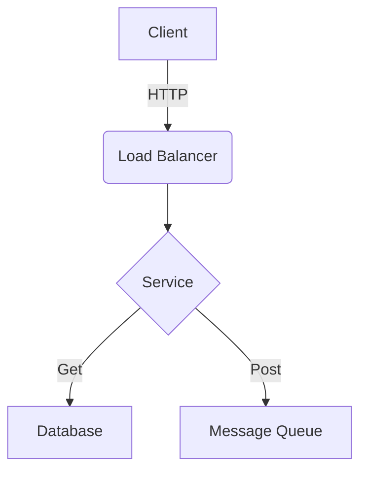

# System Design

This is a sample system design document.

## Architecture Diagram

```mermaid
graph TD
    A[Client] -->|HTTP| B(Load Balancer)
    B --> C{Service}
    C -->|Get| D[Database]
    C -->|Post| E[Message Queue]
```

## Description
The client communicates...
